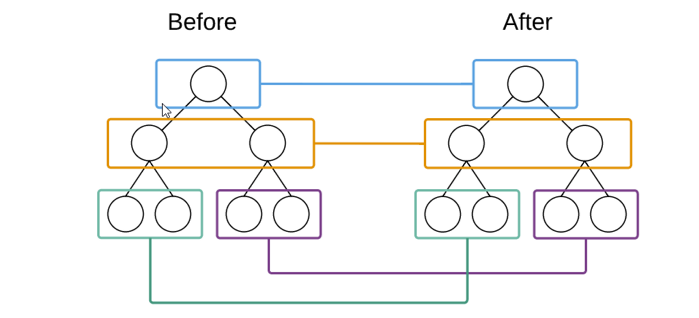

# 基础知识
  一、react简介  
      react的设计及其独特。  
      angular1不支持组件化开发，1和后面版本很大不同。  
      react版本没有断层，顺畅的迭代。
      库和框架  
      library(库)：小而巧，只提供了某些特定的api,jquery。优点：船小可以很方便的从一个库切换到另外一个库。  
      Framework:大而全的是框架。框架提供了一整套的解决方案（全家桶）。所以如果在项目中间想切换到另外的框架是比较困难的。

 二、前端三大主力框架
    Angular：（印度使用的多）ng2开始支持组件化。
    Vue：华人开发，文档稍微友好一些；
    React ：最流行（欧美使用的多）的一门框架，因为它的设计很优秀。  
  
 三、React与Vue对比  
    组件化方面  
    1、什么是模块化？是从代码的角度来进行分析的；把一些可复用的代码，抽离为单个的模块；便于项目的维护和开发。  
    2、什么是组件化?是从UI界面的角度来进行分析；把一些可复用的UI元素，抽离为单独的组件；便于项目的维护和开发。  
    3、组件化的好处：随着项目规模的增大，手里的组件越来越多；很方便就能够把现有的组件拼接为一个完整的页面。  
    4、Vue是如何实现组件化的：通过.vue文件来创建对应的组件；  
          template结构  
          script 行为  
          style  样式  
    5、React如何实现组件化：React中有组件化的概念，但是，并没有像Vue这样的组件模板文件；React中，一切都是以JS来表现的；因此要学习React，JS要合格；ES6和ES7(async和await)要会用。    

 四、社区方便React更为强大  
 五、移动APP开发体验方面
    Vue：结合Weex这门技术，提供了迁移到移动App开发的体验（Weex，目前只是一个小的玩具，并没有很成功的大案例）  
    React:结合ReactNative,也提供了无缝迁移到移动App的开发体验（RN用的最多，也是最火最流行的）;  
 六、虚拟DOM    
    DOM和虚拟DOM的区别：  
    DOM：浏览器中，提供的概念。用JS对象来表示页面上的元素，并提供了操作DOM对象的API;  
    虚拟DOM：是框架中的概念，程序员手动用JS对象来模拟DOM元素和嵌套关系；  
    本质：用JS对象来模拟DOM元素和嵌套关系；  
    目的：就是为了实现页面元素的高效更新。 
     1、数组数据是怎么渲染到页面上的？  
     方案1：手动for循环整个数组，然后手动拼接字符串str += `<tr></tr>`
     方案2：使用模板引擎，art-template。其实本质也是拼接字符串  
     方案1和方案2会有性能上的问题，只是实现了把数据渲染到页面上的能力，但是并没有把性能做到最优。
     如何才能把性能做到最优：按需渲染页面，只重新渲染更新的数据所对应的页面元素。  
     2、如何实现按需渲染？  
     （1）、DOM树  
        一个网页呈现的过程：
        浏览器请求服务器获取页面HTML代码；浏览器要在内存中解析DOM结构，并在浏览器内存中渲染出一颗DOM树；浏览器把DOM树呈现到页面上。  
      （2）、获取内存中的新的两颗DOM树，进行对比，得到需要被按需更新的DOM元素。
          分析：浏览器中，并没有直接提供获取DOM树的API，因此，我们无法拿到浏览器内存中的DOM树。但可以手动模拟新旧两颗DOM树。可以先模拟一个DOM元素。  
            JS模拟DOM元素:  
            
            
好帅
呵呵呵

            let div = {
              tagName:'div',
              attr:{
                id:'mydiv',
                title:'哈哈',
                'data-index':'0'
              },
              childrens:[
                '好帅',
                {
                  tagName:'p',
                  attrs:{},
                  childrens:[
                    '呵呵呵'
                  ]
                }
              ]
            }  

  （3）、程序员手动模拟的这两颗新旧DOM树，就是React中的虚拟DOM的概念。
    总结：什么是虚拟DOM:用JS对象的形式，来模拟页面上的DOM嵌套关系。（虚拟DOM是以JS对象的形式存在的。）本质是用JS对象来模拟DOM元素和嵌套关系。目的：就是为了实现页面元素的高效更新。  

  七、Diff算法(different)  
        **tree diff**  新旧两颗DOM树，逐层之间的对比的过程，从上到下；当整颗DOM逐层对比完毕，则所需要被按需更新的元素，必然能够找到。  
        **component diff**  在进行Tree Diff的时候，每一层中，组件级别的对比叫做Component Diff;如果对比前后，组件的类型相同，则**暂时**认为此组件不需要被更新；如果对比前后，组件类型不同，则需要移除旧组件，创建新组件，并追加到页面上。   
        **element diff**  在进行组件对比的时候，如果两个组件类型相同，则需要进行元素级别的对比。  
           
  # webpack4.x
  创建项目  
  1、npm init -y  快速初始化一个项目  
  2、在项目根目录中创建src源代码目录和dist产品目录  
    src源文件  
        index.html首页  
        main.js入口文件  

    dist 项目做好后要发布到dist目录中去  
    安装cnpm    npm i cnpm -g  
    webpack4.x版本将打包和命令行分开了。打包的命名行不再由webpack提供，而是由webpack-cli提供了。  
    webpack是基于Node构建的，所以webpack支持所有的Node API 和 语法。
    在webpack4.x中，有一个很大的特性，就是约定大于配置，默认的打包入口路径时src -> index.js;目的是为了尽量减少配置文件的体积。

      默认约定了：
      打包的入口src -> index.js
      打包的输出文件dist -> main.js

          